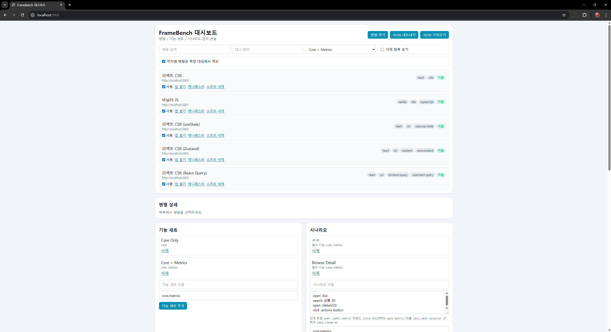
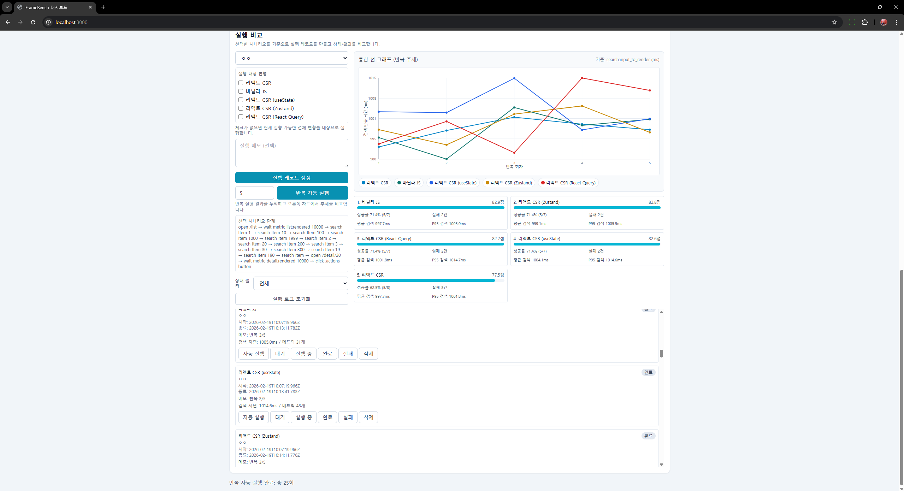

# FrameBench

백엔드 없이 프론트엔드 구현별 성능 실험을 수행하는 모노레포입니다.

- 관리 콘솔: `apps/dashboard` (React + Vite + Tailwind)
- 비교 대상: `apps/vanilla`, `apps/react-csr`
- 확장 슬롯: `apps/vue`

## 목표

- 동일한 UI/기능을 여러 구현으로 유지
- 대시보드에서 Variant/FeatureSet/Scenario/Run 관리
- 자동 시나리오 실행으로 성능 지표 비교

## 모노레포 구조

```text
.
├─ apps/
│  ├─ dashboard/   # 관리 콘솔
│  ├─ vanilla/     # 바닐라 TS + Vite
│  ├─ react-csr/   # React CSR + case 전환(use-state/zustand/react-query)
│  └─ vue/         # 확장 자리(스켈레톤)
├─ docs/
│  └─ assets/      # README 이미지
├─ package.json
└─ pnpm-workspace.yaml
```

## 요구 환경

- Node.js `20+`
- pnpm은 `corepack` 경유 사용 권장

## 실행 방법

1. 의존성 설치

```bash
corepack pnpm install
```

2. 전체 개발 서버 실행

```bash
corepack pnpm dev
```

3. 빌드/린트

```bash
corepack pnpm build
corepack pnpm lint
```

## 포트

- `dashboard`: `http://localhost:3000`
- `vanilla`: `http://localhost:3001`
- `react-csr`: `http://localhost:3002`

React CSR 라이브러리 케이스:
- `http://localhost:3002/?case=use-state`
- `http://localhost:3002/?case=zustand`
- `http://localhost:3002/?case=react-query`

## 현재 구현 범위

- 공통 라우트: `/`, `/list`, `/detail/:id`
- 데이터: 로컬 JSON 2000개 사용
- 목록: 검색(250ms 디바운스), 정렬, 카테고리 필터
- 상세: 장바구니 담기(앱 내부 메모리 상태)
- 목록 UI 렌더는 가독성/안정성을 위해 상위 200개로 제한

## Dashboard 기능

- Variant 등록/검색/태그 수정/활성 토글
- Variant soft-delete/복구
- FeatureSet CRUD + 활성 FeatureSet 선택
- Scenario CRUD (DSL 스텝 저장)
- Run 생성/상태 변경/삭제/일괄 초기화
- JSON Import/Export
- Variant URL 등록 시 `${baseUrl}/manifest.json` fetch + 스키마 검증
- 미지원 Feature 표시 및 측정 제외 토글
- 반복 자동 실행(N회) + 통합 선 그래프 + 요약 점수

## 자동화 실행 모델

- 실행은 큐 기반 순차 처리
- 생성되는 실행 수: `반복 횟수 × 선택된 변형 수`
- 각 실행은 iframe 메시지 기반으로 변형 앱에 시나리오 전달
- 시나리오 길이에 따라 자동 타임아웃 계산
- 타임아웃 범위: 최소 15초, 최대 180초

## Scenario DSL

- `open /path`
- `search 키워드`
- `click CSS선택자`
- `wait metric 메트릭이름 [timeoutMs]`
- `wait selector CSS선택자 [timeoutMs]`
- `sleep ms`

예시:

```text
open /list
wait metric list:rendered 10000
search Item 20
open /detail/20
wait metric detail:rendered 10000
click .actions button
```

`click` 별칭:
- `add-to-cart`, `add_to_cart`, `cart` 입력 시 내부적으로 `.actions button`으로 정규화

## Metrics

수집 저장소:
- `window.__APP_METRICS__`

기본 마크/측정:
- `performance.mark('app:start')`
- `mark('list:rendered')`
- `mark('detail:rendered')`
- `measure('search:input_to_render', 'search:input', 'search:rendered')`

대시보드의 `메트릭 n개`:
- 해당 run에서 수집된 `mark + measure` 이벤트 총개수

## 점수 계산

- 성공률: `completed / (completed + failed)`
- 속도 점수: 평균 `search:input_to_render`를 best 대비 상대 점수로 환산
- 효율 점수: `성공률(60%) + 속도 점수(40%)`

## Manifest 스키마

각 앱은 `GET /manifest.json` 제공:

```json
{
  "id": "react-csr",
  "name": "리액트 CSR",
  "tech": ["react", "vite", "zustand", "tanstack-query"],
  "version": "0.1.0",
  "baseUrl": "http://localhost:3002",
  "routes": ["/", "/list", "/detail/:id"],
  "supportedFeatures": ["core", "metrics", "multi-case"],
  "build": { "commit": "dev", "timestamp": "dev" }
}
```

검증 규칙:
- 필수 메타 필드 존재
- `tech/routes/supportedFeatures` 문자열 배열
- `routes`에 `/, /list, /detail/:id` 포함
- `build.commit`, `build.timestamp` 문자열

## Dashboard 저장 모델

localStorage 키:
- `framebench:dashboard:v1`

타입:

```ts
Variant: id, name, baseUrl, manifestUrl, enabled, deletedAt?, tags[], supportedFeatures?
FeatureSet: id, name, features[]
Scenario: id, name, steps[], requiredFeatures[]
RunRecord: id, scenarioId, variantId, startedAt, endedAt?, status, notes?, metrics?, error?
```

Import/Export 포맷:

```json
{
  "exportedAt": "2026-02-19T00:00:00.000Z",
  "data": {
    "variants": [],
    "featureSets": [],
    "scenarios": [],
    "runs": [],
    "activeFeatureSetId": "core-metrics",
    "excludeUnsupportedFromMeasurement": true
  }
}
```

## Seed 데이터 동작

- 최초 실행 시 localhost 기본 변형/기능세트/시나리오를 seed로 생성
- 저장 데이터 로드시 seed ID가 누락되어 있으면 자동으로 다시 추가
- 따라서 seed 항목은 soft-delete해도 이후 다시 보일 수 있음

## 스크린샷

### 대시보드 상단 (변형/기능세트/시나리오 관리)



### 대시보드 하단 (실행 비교/통합 선 그래프/실행 로그)


